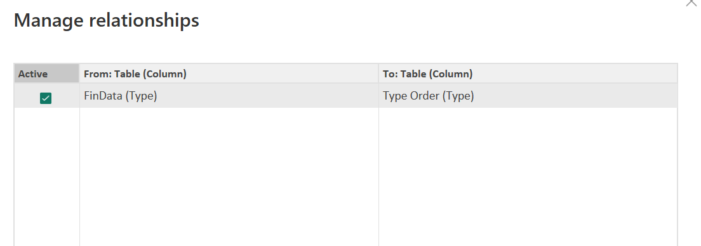
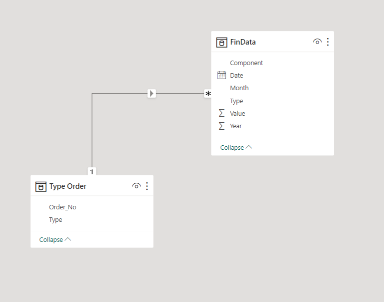
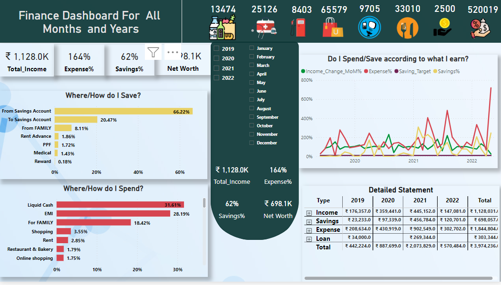
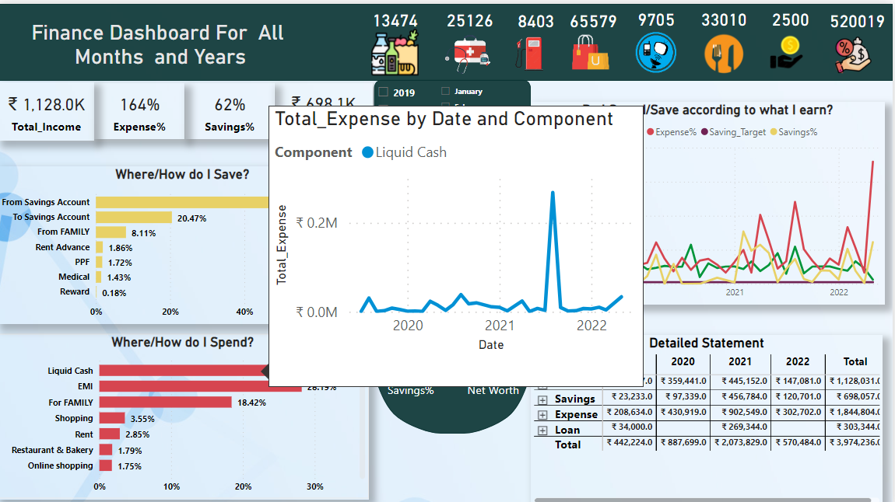
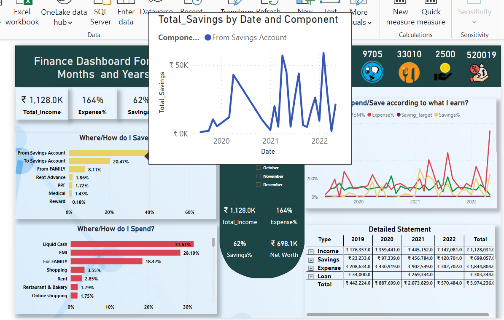
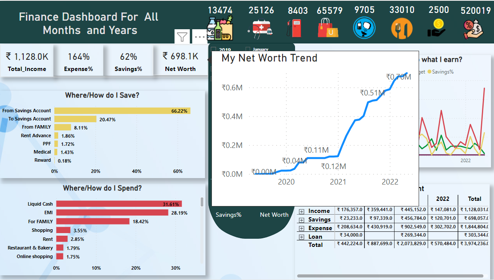

# Personal-Finance-Dashboard-Power-BI

## Introduction
In this data analytics project, we will build a personal finance dashboard in power BI. This project can be useful to anyone who wants to track personal expenses, income and financial goals.

## Skills/Concepts Demonstrated
The following Power BI features were incorporated:
- Dynamic title
- Edit interaction
- DAX (Calculate())
- Key Measures
- Page navigation
- Modelling
- ToolTip  

## Problem Statement
1.	What is my Net Worth?
2.	Is my spending pattern right?
3.	Am I reaching my savings target?
4.	Which months are financially bad/good?
5.	Where/how do I spend?
6.	 Where/how do I save?

## Data Modelling
Power BI automatically connected related tables resulting in a star schema model.FinData is a fact table for the model and Type Order is dimension table for the model.
The relationship and the model are shown in the below screenshots:

Relationship                  |     Data-model
:---------------------------: | :-------------------------:
 |  

## Data Source
Fetched the data from ABC bank statement May,2019 – May,2022  
## Data Transformation/Cleaning
1.	Since, date are in each column that need to be transformed to Row wise. Select the date column in Query editor and Transform->Unpivot columns. Update the data type of Attribute column to Date type.
2.	We need a year column, Add column -> Date->Year->Year.
3.	Renamed the column from Attribute to Date.
4.	Again, to get month column, Add column -> Date->Month->Month
5.	Created a table for Key Measures,Enter data->Table name:’Key Measures’

## Visualizations
The report has only 1 page with the following Key measures:  
1.	Amount = SUM(FinData[Value])
2.	Total income = CALCULATE(SUM(FinData[Value]),FinData[Type]="Income")
3.	Total expense = CALCULATE(SUM(FinData[Value]),FinData[Type]="Expense")
4.	Total savings = CALCULATE(SUM(FinData[Value]),FinData[Type]="Savings")
5.	Expense% = DIVIDE([Total_Expense],[Total_Income])
6.	Savings% = DIVIDE([Total_Savings],[Total_Income])
7.	Dynamic Title = "Finance Dashboard For " & SELECTEDVALUE(FinData[Month]," All Months") & " " & SELECTEDVALUE('FinData'[Year]," and Years")

## Analysis
  
We have made 4 boxes which are stagnant all time at the top left and the other 4 box which will be dynamic as per the selection of year and month.  

Added all the basic expenses at the top right and have enabled the tooltip option to know the specific expenses.  

For the Bar chart **‘Where/how do I Spend?’**  we have dropped the Expense % and component in respective axis. 
Here we can see the way I disbursed money by withdrawing the cash and don’t know for what all-purpose I have spent which is a bad habit of using money. And 28.19% of money is used for paying EMI for the last 3 years.  
Also, we have used tooltip to know how each component is spent over years and months?    

     

For the Bar chart **‘Where/how do I Save?’** here we can see that I have transferred 66.2% of money saved to my current account and don’t know in what all ways the money was used.  
For the last 3 years (2019-2022) only 20.47% of salary is used for saving. This shows that I should improve my financial discipline.  
We have used tooltip to know how each component is saved over years and months?    

     

In the Line chart **‘Do I spend/save according to what I earn?’** here says that if there is a salary hike, is my savings are increasing or not? For that we have created few measures that gives the income of the previous month and percentage change.  
  Income_LM = CALCULATE([Total_Income],
                      dateadd(FinData[Date],-1,MONTH))  
  
  Income_Change_MoM% = DIVIDE([Total_Income],[Income_LM])  
Here, we have set a saving target measure with 10% (.10) that helps to compare against the income.  

The Matrix chart ‘Detailed Statement’ is really insightful, because in one shot, we can analyse it. We can see that my income is increasing from the year 2019 which means I got the job but then income suddenly reduced at 2022 shows that I resigned my job. Now, the worst part is my expense is more than the income and have least savings too. Since the statement is in Matrix form, we can drill it down the various components.  

Also, we have added the cumulative running for total savings, using the below DAX measure and enabled tooltip over Net worth metrics:  
   Cumulative Net Worth = 
   CALCULATE ([Total_Savings],FILTER (ALL ( FinData[Date] ),FinData[Date] <= MAX ( ( FinData[Date] ) )))    

    

## Suggestion: 
The above analysis says that there should be an immediate improvement in financial health, as we can see the expense is more than income and an urge to increase the savings target from 10% to 30% which is a financial rule that will help to lead a stable financial discipline.

